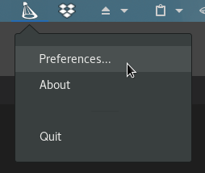

# Projecteur

develop: 
master: 

Linux/X11 application for the Logitech Spotlight device.

Copyright 2018 [Jahn Fuchs](mailto:github.jahnf@wolke7.net)

## Motivation

I saw the Logitech Spotlight device in action at a conference and liked it
immediately. Unfortenately as in a lot of cases software is only provided for Windows
and Mac. The device itself works just fine on Linux, but the cool spot feature
is done by additional software.

So here it is: a Linux application for the Logitech Spotlight.

## Features

* Configurable desktop spotlight. Configure color, opacity, cursor, center dot.
* Multiple screen support

## Supported Environments

The application was tested only on Ubuntu 18.04 (GNOME) and OpenSuse 42.3 (GNOME)
but should work on almost any Linux/X11 Desktop. Make sure you have the correct
udev rules installed (see Installation Pre-requisites).

## How it works

Basically the USB Dongle Receiver of the Logitech Spotlight device will end up
being detected as one mouse input device and one keyboard input device.
The mouse input device sends relative cursor coordinates and left button presses.
The keyboard device basically just sends left and right arrow key events when
forward or back on the device is pressed.

The dectected mouse input device is what we are interested in. Since it's
already detected as a mouse input device and able to move the cursor, we will
simply detect if it is the Spotlight device which is sending mouse events.
If it is sending mouse events, we will 'turn on' the desktop spot.

For more details: Have a look at the source code ;)

## Building

### Requirements

* C++11 compiler
* CMake 3.6 or later
* Qt 5.6 (Might also work in earlier Qt5 versions - but not tested)

### Build Example

      > git clone https://github.com/jahnf/projecteur
      > cd projecteur
      > mkdir build && cd build
      > QTDIR=/opt/Qt/5.9.6/gcc_64 cmake ..
      > make

## Installation/Running

### Pre-requisites

The input devices detected from the Spotlight device must be readable to the
user running the application. To make this easier there is a udev rule template
file in this repository: `55-spotlight.rules`

* Copy this file to /etc/udev/rules.d/55-spotlight.rules and update the
  'plugdev' group in the file to a group you are a member in
* Run `sudo udevadm control --reload-rules` and `sudo udevadm trigger` to load
  the rules without a reboot.
* After that the two input devices from the Logitech USB Receiver in /dev/input
  should have the group 'plugdev', i.e. the group you configure in the rules file.

### Application Menu

The application menu is accessable via the system tray icon. There you will find
the preferences and the menu entry to exit the application.
